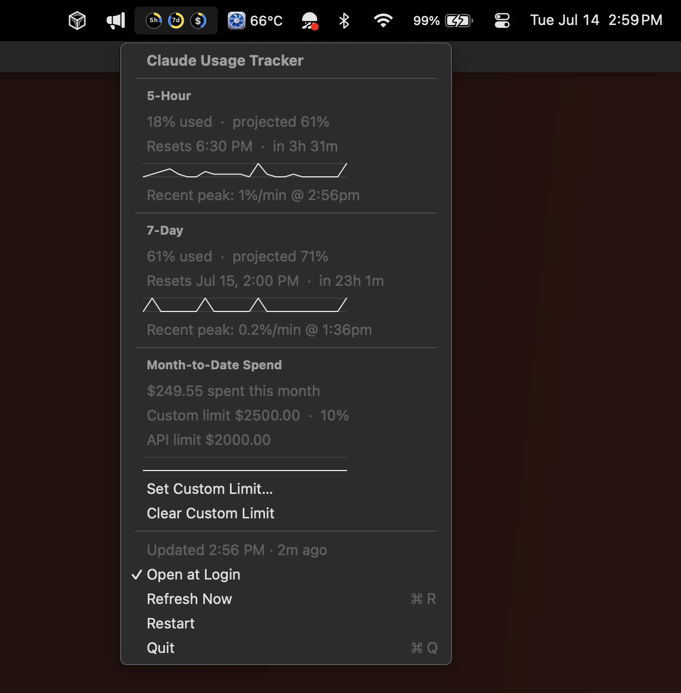

# AI Usage Tracker

A macOS menu-bar app that charts your AI coding-tool usage as donut circles — one
per rate-limit window for each enabled provider (**Claude**, **Codex**, **Cursor**),
plus a combined **cost** circle for pay-as-you-go spend.



Each donut overlays two clockwise arcs from 12 o'clock: the elapsed **time** wedge
(a darker shade, spanning the full radius) and the **usage** ring (the brighter
brand color, in the outer lane) — so at a glance you see usage against how far into
the window you are. Providers are color-coded: Claude orange, Codex blue, Cursor
violet; the cost circle is white over gray.

Windows differ by provider: Claude has a 5-hour and a 7-day window; Codex a 5-hour
plus weekly window (or a single window on the free plan); Cursor a monthly billing
cycle. The cost circle sums every provider's month-to-date overage against a single
cost total.

Click the icon for details per provider — current % + projected end-of-window % +
reset time for each window, a per-column usage-rate sparkline, and a recent-peak
readout — plus the combined spend with a per-provider breakdown, and when each last
refreshed. If a provider's last fetch failed, its circle is replaced by a
color-tinted ⚠︎ glyph and its section shows the error with a **Copy Error** action,
without affecting the other providers.

### Providers

Enable or disable each provider from the menu → **Providers**. Claude is on by
default; turn on Codex and Cursor as you use them. Each reads its own local
credentials:

- **Claude** — the `Claude Code-credentials` Keychain item (Claude.ai subscription).
- **Codex** — `~/.codex/auth.json` (ChatGPT login).
- **Cursor** — the `cursor-access-token` Keychain item.

### Cost total

The cost circle fills against a cost total that defaults to **$2500**. Change it from
the menu → **Set Custom Cost Total…**.

## Install

Runs on **macOS 13 (Ventura) or later**, on both Apple Silicon and Intel Macs.

1. Download `AIUsageTracker.zip` from the [latest release](../../releases/latest).
2. Unzip it and drag **AI Usage Tracker.app** into `/Applications`.
3. Open it. It's signed and notarized by Apple, so it launches without warnings
   (on first open macOS confirms it was downloaded from the internet — click
   **Open**).

## Building from source

Requires macOS 13+ and the Swift toolchain (install Xcode or the Command Line
Tools: `xcode-select --install`).

```bash
# 1. Build and package the app bundle (compiles, bundles, and codesigns).
./scripts/make-app.sh

# 2. Launch it.
open "build/AI Usage Tracker.app"
```

The donuts appear in your menu bar. The first time a provider fetches, macOS may ask
permission to read its Keychain item — click **Always Allow**. The app only reads
those credentials, and talks only to each provider's own API.

### Open at Login

It's **on by default** — the app registers itself as a login item the first time it
runs, so it comes back after a reboot. Toggle it any time from the menu (**Open at
Login**); your choice sticks.

## Building a release

`./scripts/make-release.sh` produces the distributable artifact: a universal
(arm64 + x86_64) build, signed with a Developer ID Application certificate under a
hardened runtime, notarized by Apple, and stapled. Output is `build/AIUsageTracker.zip`
— attach it to a GitHub Release.

One-time setup:

1. A **Developer ID Application** certificate in your login Keychain (Xcode →
   Settings → Accounts → Manage Certificates → **+**). Requires an Apple Developer
   Program membership.
2. Notarization credentials stored under a keychain profile:

   ```bash
   xcrun notarytool store-credentials "claude-usage-notary" \
     --apple-id "you@example.com" --team-id <YOUR_TEAM_ID>
   ```

   (Uses an [app-specific password](https://appleid.apple.com).) Override the profile
   name with `NOTARY_PROFILE=… ./scripts/make-release.sh` if you use a different one.

## Notes

- Each provider is fetched at most **once every 5 minutes**, independently. The last
  fetch time and reading are cached to disk per provider, so restarting doesn't
  trigger an extra API call within that window. The donuts show each provider's last
  snapshot: the time arc does **not** creep between fetches (which would misrepresent
  usage-vs-time). Only the menu's reset countdowns and "updated … ago" text advance
  with the clock, refreshed each time you open the menu.
- A provider whose credentials are missing (e.g. an API-key-only Claude account) is
  noted in its section and stops polling; the others keep working.
- Runtime log: `~/Library/Logs/AIUsageTracker.log`.
- Tests: `swift test`. Preview render: `swift run AIUsageTracker --render /tmp/preview.png`.
